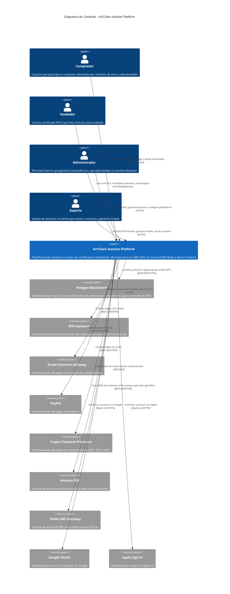

# C4 Model - Nivel 1: Diagrama de Contexto

**Sistema:** ArtChain Auction Platform
**Fecha:** 7 de Noviembre, 2025
**Versión:** 1.0
**Estado:** Fase 1 - MVP

---

## 1. Descripción del Sistema

### Propósito

**ArtChain Auction Platform** es una plataforma de subastas en línea especializada en arte y artículos de colección que utiliza tecnología blockchain (Polygon) para garantizar la autenticidad y transparencia en las transacciones.

### Objetivos Principales

1. **Confianza y Transparencia:** Certificación digital de autenticidad mediante blockchain para cada artículo
2. **Experiencia de Usuario:** Subastas en tiempo real con pujas validadas en <2 segundos
3. **Seguridad:** Procesamiento seguro de pagos con escrow y compliance PCI-DSS
4. **Escalabilidad Global:** Soportar 10,000 usuarios concurrentes en múltiples regiones (US, EU, APAC)

### Alcance del Sistema

**En Alcance (Fase 1 - MVP):**
- ✅ Registro y autenticación de usuarios (email/password + OAuth social)
- ✅ Sistema de subastas en tiempo real con pujas validadas
- ✅ Certificación de autenticidad blockchain (Polygon)
- ✅ Procesamiento de pagos multi-método (tarjetas, PayPal, cripto)
- ✅ Notificaciones multi-canal (email, SMS, push, in-app)
- ✅ Búsqueda avanzada con filtros
- ✅ Panel de administración y gestión de usuarios
- ✅ Historial completo de transacciones y trazabilidad

**Fuera de Alcance (Fases Posteriores):**
- ❌ Subastas en vivo con video streaming (Fase 3)
- ❌ Aplicación móvil nativa (Fase 3)
- ❌ Sistema de recomendaciones por IA (Fase 3)
- ❌ Marketplace secundario de reventa (Fase 3)

### Características Clave

- **Real-time bidding:** Actualizaciones instantáneas vía WebSockets
- **Blockchain certification:** Cada artículo tiene certificado NFT inmutable
- **Multi-role RBAC:** 4 roles (Buyer, Seller, Admin, Support) con permisos granulares
- **Multi-región:** Deployment en US-EAST-1, EU-WEST-1, AP-SOUTHEAST-1
- **High availability:** 99.9% uptime SLA

---

## 2. Diagrama de Contexto



---

## 3. Descripción de Elementos

### 3.1 Actores del Sistema (Personas)

#### 👤 Comprador (Buyer)

**Rol:** Usuario final que participa en subastas

**Objetivos:**
- Descubrir artículos de arte y coleccionables auténticos
- Participar en subastas con confianza en la autenticidad
- Realizar pujas en tiempo real
- Ganar subastas y adquirir artículos certificados
- Obtener certificados digitales de propiedad (NFT)

**Interacciones principales:**
- Buscar y filtrar artículos en subasta
- Ver detalles completos con certificado blockchain
- Realizar pujas (validadas en <2 segundos)
- Recibir notificaciones de estado (puja superada, ganador)
- Procesar pago cuando gana subasta
- Descargar certificado de autenticidad NFT

**Volumen esperado:**
- Fase 1: ~500 usuarios registrados, ~100 activos
- Fase 2: ~5,000 usuarios registrados, ~2,000 activos
- Fase 3: ~50,000 usuarios registrados, ~10,000 activos

---

#### 🎨 Vendedor (Seller)

**Rol:** Usuario verificado que lista artículos para venta

**Objetivos:**
- Listar artículos de arte para subasta
- Alcanzar audiencia global de coleccionistas
- Obtener certificación blockchain de autenticidad
- Monitorear subastas en tiempo real
- Recibir pagos seguros

**Interacciones principales:**
- Completar proceso KYC (verificación de identidad)
- Crear listados de artículos con documentación
- Subir imágenes (3-15 por artículo)
- Establecer precio inicial y de reserva
- Monitorear pujas en tiempo real
- Recibir notificaciones de eventos
- Recibir pago (menos comisión 8%) después de venta

**Requisitos especiales:**
- ⚠️ KYC obligatorio antes de listar
- ⚠️ Aprobación de admin para cada listado
- ⚠️ Verificación de documentación de autenticidad

**Volumen esperado:**
- Fase 1: ~50 vendedores verificados
- Fase 2: ~500 vendedores verificados
- Fase 3: ~5,000 vendedores verificados

---

#### 👨‍💼 Administrador (Admin)

**Rol:** Personal interno de ArtChain con acceso completo

**Objetivos:**
- Mantener calidad e integridad de la plataforma
- Aprobar/rechazar listados de vendedores
- Gestionar usuarios (suspender, verificar, eliminar)
- Resolver disputas entre usuarios
- Configurar parámetros de la plataforma
- Supervisar operaciones y transacciones

**Interacciones principales:**
- Revisar y aprobar listados de artículos
- Verificar documentación de autenticidad
- Gestionar usuarios (CRUD completo)
- Resolver disputas y tickets escalados
- Acceder a analytics y reportes completos
- Configurar categorías, comisiones, parámetros
- Supervisar transacciones blockchain

**Permisos:**
- ✅ Acceso total (wildcard `*:*`)
- ✅ Puede modificar datos financieros
- ✅ Puede acceder a datos de todos los usuarios

**Volumen esperado:** 5-10 admins internos

---

#### 🎧 Soporte (Support)

**Rol:** Equipo de atención al cliente (primera línea)

**Objetivos:**
- Asistir a usuarios con problemas técnicos
- Responder preguntas frecuentes
- Gestionar tickets de soporte
- Escalar casos complejos a administradores

**Interacciones principales:**
- Consultar información de usuarios (limitado)
- Ver historial de transacciones (solo lectura)
- Gestionar tickets de soporte
- Asistir en resolución de problemas comunes
- Escalar casos que requieren modificación de datos

**Restricciones:**
- ❌ NO puede modificar datos financieros
- ❌ NO puede modificar datos blockchain
- ❌ NO puede suspender usuarios (solo admin)
- ✅ Acceso limitado a información sensible

**Volumen esperado:** 5-15 agentes de soporte

---

### 3.2 Sistema Principal

#### 🏛️ ArtChain Auction Platform

**Tipo:** Sistema de software (web application)

**Descripción:**
Plataforma de subastas en línea especializada en arte y coleccionables con certificación blockchain. Arquitectura de microservicios desplegada en AWS con frontend React y backend Node.js/Java.

**Responsabilidades principales:**
1. **Gestión de usuarios:** Registro, autenticación (OAuth 2.0 + JWT), autorización (RBAC), perfiles
2. **Sistema de subastas:** Creación, gestión, pujas en tiempo real, finalización automática
3. **Certificación blockchain:** Integración con Polygon para certificados de autenticidad y NFTs
4. **Procesamiento de pagos:** Escrow, múltiples métodos de pago, comisiones automáticas
5. **Notificaciones:** Multi-canal (email, SMS, push, in-app) para eventos críticos
6. **Búsqueda:** Full-text search con filtros avanzados (OpenSearch)
7. **Analytics:** Dashboard para vendedores y administradores

**Tecnologías clave:**
- **Frontend:** React 18 + TypeScript + Redux Toolkit
- **Backend:** Node.js 20 (TypeScript) + Java 21 (Spring Boot)
- **Database:** DynamoDB (primary), ElastiCache Redis (cache), OpenSearch (search)
- **Infrastructure:** AWS EKS (Kubernetes), CloudFront CDN, Route 53
- **Messaging:** Amazon SQS, WebSockets (Socket.io)

**Capacidad:**
- 10,000 usuarios concurrentes (Fase 2)
- 100,000 requests/min
- Latencia <200ms (p95)
- Disponibilidad 99.9%

**Regiones:**
- 🇺🇸 US-EAST-1 (Virginia) - Principal
- 🇪🇺 EU-WEST-1 (Irlanda) - Secundaria
- 🇸🇬 AP-SOUTHEAST-1 (Singapur) - Secundaria

---

### 3.3 Sistemas Externos

#### ⛓️ Polygon Blockchain

**Tipo:** Sistema externo (blockchain network)

**Propósito:**
Red blockchain Layer 2 de Ethereum que proporciona certificación de autenticidad, registro inmutable de pujas y emisión de NFTs de propiedad.

**Integración:**
- **Protocolo:** JSON-RPC sobre HTTPS
- **Libraries:** Ethers.js / Web3.js
- **Smart Contracts:** Solidity 0.8.x (ItemAuthenticity, AuctionBid, Ownership)
- **Network:** Polygon PoS Mainnet (producción), Mumbai Testnet (desarrollo)

**Funcionalidades utilizadas:**
1. **Certificación de artículos:** Registro de metadata hash en blockchain
2. **Registro de pujas:** Inmutabilidad y transparencia de historial de ofertas
3. **NFT de propiedad:** ERC-721 tokens como certificados digitales
4. **Trazabilidad:** Historial completo de propiedad y transferencias

**Características:**
- ⚡ Velocidad: 2 segundos por bloque
- 💰 Costo: ~$0.01-0.05 por transacción
- ✅ Finality: <30 segundos
- 🔒 Seguridad: 100+ validadores, $1B+ TVL

**Alternativa:** Ethereum Mainnet solo para artículos ultra alto valor (>$1M)

**Referencias:** [ADR-009: Polygon Blockchain](../adrs/ADR-009-polygon-blockchain.md)

---

#### 📦 IPFS Network (Pinata/Infura)

**Tipo:** Sistema externo (almacenamiento descentralizado)

**Propósito:**
Almacenamiento descentralizado de metadata extensa de artículos (imágenes, descripciones, certificaciones) referenciada desde blockchain.

**Integración:**
- **Protocolo:** HTTPS (Pinata/Infura gateways)
- **Library:** ipfs-http-client
- **Pinning Service:** Pinata o Infura IPFS

**Funcionalidades utilizadas:**
1. **Upload de metadata:** JSON con información completa del artículo
2. **Upload de imágenes:** Hashes de imágenes de alta resolución
3. **Retrieval:** Fetch de metadata usando CID (Content Identifier)
4. **Pinning:** Garantizar disponibilidad permanente de archivos

**Datos almacenados:**
```json
{
  "name": "Título del artículo",
  "artist": "Nombre del artista",
  "year": 2020,
  "description": "Descripción detallada...",
  "images": ["ipfs://Qm...", "ipfs://Qm..."],
  "certifications": ["Galería X", "Experto Y"],
  "certifiedAt": "2025-11-07T10:00:00Z"
}
```

**Ventajas:**
- 🌐 Descentralizado (no single point of failure)
- 🔒 Inmutable (content-addressed)
- 💾 Costo-eficiente (vs almacenar todo en blockchain)

---

#### 💳 Stripe Payment Gateway

**Tipo:** Sistema externo (procesamiento de pagos)

**Propósito:**
Procesamiento seguro de pagos con tarjetas de crédito/débito (Visa, Mastercard, Amex, etc.).

**Integración:**
- **Protocolo:** REST API / HTTPS
- **Library:** Stripe SDK (Node.js, Java)
- **Compliance:** PCI-DSS Level 1

**Funcionalidades utilizadas:**
1. **Payment Intents:** Autorización y captura de pagos
2. **Customer Management:** Almacenar métodos de pago
3. **Webhooks:** Notificaciones de eventos (payment succeeded, failed)
4. **Disputes:** Gestión de chargebacks
5. **Connect (Fase 2):** Pagos directos a vendedores

**Flujo de pago:**
```
1. Usuario gana subasta
2. ArtChain crea Payment Intent
3. Frontend muestra Stripe Elements (secure form)
4. Usuario ingresa tarjeta
5. Stripe procesa pago
6. Fondos a escrow ArtChain
7. Confirmación de entrega
8. Transferencia a vendedor (menos comisión 8%)
```

**Comisiones:**
- Stripe: 2.9% + $0.30 por transacción
- ArtChain (buyer): 3% del precio final (mín. $5)
- ArtChain (seller): 8% del precio final

---

#### 🅿️ PayPal

**Tipo:** Sistema externo (procesamiento de pagos)

**Propósito:**
Método de pago alternativo para usuarios que prefieren PayPal.

**Integración:**
- **Protocolo:** REST API / HTTPS
- **Library:** PayPal SDK

**Funcionalidades utilizadas:**
1. **PayPal Checkout:** Redirección a PayPal para autenticación
2. **Order Creation:** Crear orden de pago
3. **Order Capture:** Capturar fondos después de aprobación
4. **Webhooks:** Notificaciones de eventos

**Ventajas:**
- 🌍 Aceptado globalmente
- 🔐 Buyer protection
- 💰 Alternativa sin tarjeta

---

#### ₿ Crypto Payment Processor

**Tipo:** Sistema externo (procesamiento de pagos en criptomonedas)

**Propósito:**
Procesamiento de pagos en criptomonedas (BTC, ETH, USDC) para usuarios crypto-native.

**Integración:**
- **Provider:** BitPay, Coinbase Commerce, o similar
- **Protocolo:** REST API / HTTPS
- **Cryptocurrencies:** Bitcoin (BTC), Ethereum (ETH), USD Coin (USDC)

**Funcionalidades utilizadas:**
1. **Charge Creation:** Crear invoice de pago
2. **Address Generation:** Generar dirección única por pago
3. **Payment Detection:** Monitoreo de transacciones on-chain
4. **Conversion:** Automática a USD/EUR

**Ventajas:**
- ⚡ Transacciones rápidas (especialmente USDC)
- 🌍 Sin fronteras
- 💸 Fees bajos
- 🎯 Público crypto-savvy

**Fase:** Implementación en Fase 2

---

#### 📧 Amazon SES (Simple Email Service)

**Tipo:** Sistema externo (envío de emails)

**Propósito:**
Servicio managed de AWS para envío de emails transaccionales y notificaciones.

**Integración:**
- **Protocolo:** SMTP o AWS SDK (API)
- **Library:** Nodemailer con SES transport
- **Autenticación:** IAM roles

**Funcionalidades utilizadas:**
1. **Transactional Emails:**
   - Verificación de email (registro)
   - Confirmación de puja
   - Notificación ganador
   - Confirmación de pago
   - Envío de certificado

2. **Templates:** Emails con HTML/CSS responsivo
3. **Tracking:** Open rate, click rate (opcional)
4. **Bounce Management:** Manejo de emails inválidos

**Características:**
- 📊 High deliverability (>95%)
- 💰 Costo bajo ($0.10 por 1,000 emails)
- ⚡ Envío rápido (<1 segundo)
- 🔒 DKIM/SPF configurado

**Volumen esperado:**
- Fase 1: ~10K emails/mes
- Fase 2: ~100K emails/mes
- Fase 3: ~1M emails/mes

---

#### 📱 Twilio SMS Gateway

**Tipo:** Sistema externo (envío de SMS)

**Propósito:**
Servicio de envío de SMS para notificaciones críticas que requieren atención inmediata.

**Integración:**
- **Protocolo:** REST API / HTTPS
- **Library:** Twilio SDK (Node.js)

**Funcionalidades utilizadas:**
1. **SMS Transaccionales:**
   - Tu puja fue superada
   - Ganaste la subasta
   - Código MFA (2FA)
   - Artículo enviado

2. **International SMS:** Soporte multi-país
3. **Delivery Receipts:** Confirmación de entrega

**Características:**
- 🌍 Global coverage (200+ países)
- ⚡ Entrega rápida (<5 segundos)
- 💰 Costo: ~$0.01-0.10 por SMS (varía por país)

**Uso selectivo:**
- Solo eventos críticos (no marketing)
- Usuario puede opt-out
- Preferencias configurables

**Volumen esperado:**
- Fase 1: ~2K SMS/mes
- Fase 2: ~20K SMS/mes
- Fase 3: ~200K SMS/mes

---

#### 🔐 Google OAuth

**Tipo:** Sistema externo (autenticación social)

**Propósito:**
Autenticación de usuarios usando cuentas de Google (OAuth 2.0).

**Integración:**
- **Protocolo:** OAuth 2.0 Authorization Code Flow
- **Library:** Passport.js (Google Strategy)
- **Scopes:** openid, email, profile

**Flujo:**
```
1. Usuario click "Sign in with Google"
2. Redirect a Google OAuth consent screen
3. Usuario aprueba
4. Google devuelve authorization code
5. Backend exchange code por tokens
6. Obtiene perfil de usuario (email, nombre)
7. Crea o login usuario en ArtChain
8. Genera JWT tokens propios
```

**Ventajas:**
- ⚡ Registro rápido (menos fricción)
- 🔒 Seguro (no almacenamos contraseña)
- 📧 Email pre-verificado

**Adopción esperada:** ~40% de registros en Fase 2

---

#### 🍎 Apple Sign-In

**Tipo:** Sistema externo (autenticación social)

**Propósito:**
Autenticación de usuarios usando Apple ID (OAuth 2.0).

**Integración:**
- **Protocolo:** OAuth 2.0 / OpenID Connect
- **Library:** Passport.js (Apple Strategy)
- **Scopes:** openid, email, name

**Características especiales:**
- 🔒 **Hide My Email:** Apple puede ocultar email real
- ✅ Obligatorio para apps iOS (Fase 3)

**Flujo:** Similar a Google OAuth

**Ventajas:**
- 🍎 Popular en usuarios iOS/Mac
- 🔒 Privacy-focused
- ⚡ UX rápida

**Adopción esperada:** ~20% de registros en Fase 2

---

## 4. Flujos de Comunicación Principales

### 4.1 Flujo de Puja (Bidding Flow)

```
Comprador → ArtChain Platform:
  1. Busca subastas (HTTPS GET)
  2. Ve detalles de artículo (HTTPS GET)
  3. Realiza puja (HTTPS POST)

ArtChain Platform → Blockchain:
  4. Valida puja (business rules)
  5. Registra puja en Polygon (JSON-RPC)

ArtChain Platform → Comprador:
  6. Confirmación de puja (WebSocket update)

ArtChain Platform → Email/SMS:
  7. Notifica a otros compradores (puja superada)

ArtChain Platform → Seller:
  8. Actualización en tiempo real (WebSocket)
```

**Latencia total:** <2 segundos (requisito crítico)

---

### 4.2 Flujo de Certificación de Artículo

```
Vendedor → ArtChain Platform:
  1. Crea listado de artículo (HTTPS POST)
  2. Sube imágenes y documentación

Admin → ArtChain Platform:
  3. Revisa y aprueba listado (HTTPS PATCH)

ArtChain Platform → IPFS:
  4. Upload de metadata e imágenes
  5. Obtiene CID (Content Identifier)

ArtChain Platform → Blockchain:
  6. Registra certificado en smart contract
  7. Emite NFT de autenticidad
  8. Obtiene transaction hash

ArtChain Platform → Vendedor:
  9. Notifica aprobación y certificación (Email)
  10. Artículo publicado en marketplace
```

**Duración:** 2-5 minutos (incluye aprobación manual)

---

### 4.3 Flujo de Pago

```
Comprador (ganador) → ArtChain Platform:
  1. Recibe notificación (ganaste subasta)
  2. Selecciona método de pago (HTTPS POST)

ArtChain Platform → Payment Gateway (Stripe/PayPal/Crypto):
  3. Inicia transacción de pago
  4. Usuario completa pago

Payment Gateway → ArtChain Platform:
  5. Webhook: pago exitoso

ArtChain Platform:
  6. Fondos a escrow
  7. Marca subasta como pagada

[Después de confirmación de entrega]

ArtChain Platform → Payment Gateway:
  8. Transfiere a vendedor (92% del monto)

ArtChain Platform → Blockchain:
  9. Transfiere NFT de propiedad a comprador

ArtChain Platform → Comprador & Vendedor:
  10. Notificaciones de confirmación (Email/SMS)
```

**Plazo de pago:** 48 horas desde fin de subasta

---

### 4.4 Flujo de Autenticación Social

```
Usuario → ArtChain Platform:
  1. Click "Sign in with Google/Apple"

ArtChain Platform → OAuth Provider (Google/Apple):
  2. Redirect a consent screen

OAuth Provider → Usuario:
  3. Usuario aprueba permisos

OAuth Provider → ArtChain Platform:
  4. Authorization code

ArtChain Platform → OAuth Provider:
  5. Exchange code por access token

OAuth Provider → ArtChain Platform:
  6. Access token + user profile

ArtChain Platform:
  7. Busca/crea usuario en DB
  8. Genera JWT tokens propios

ArtChain Platform → Usuario:
  9. Access token + Refresh token
  10. Login exitoso
```

**Duración:** <5 segundos

---

## 5. Características No Funcionales del Sistema

### Performance
- **Latencia:** <200ms (p95), <500ms (p99)
- **Throughput:** 100,000 requests/min
- **Confirmación de puja:** <2 segundos
- **Carga de página:** <3 segundos
- **Time to Interactive:** <5 segundos

### Escalabilidad
- **Usuarios concurrentes:** 10,000+ (Fase 2)
- **Subastas activas:** 1,000+ simultáneas
- **Autoscaling:** Horizontal (EKS pods, DynamoDB on-demand)

### Disponibilidad
- **Uptime SLA:** 99.9% (43 min downtime/mes)
- **Multi-región:** Active-Active reads, Active-Passive writes
- **RTO:** 5 minutos (Recovery Time Objective)
- **RPO:** 1 minuto (Recovery Point Objective)

### Seguridad
- **Autenticación:** OAuth 2.0 + JWT (RS256)
- **Autorización:** RBAC con 4 roles
- **Encryption:** TLS 1.3 (in-transit), KMS (at-rest)
- **Compliance:** PCI-DSS (pagos), GDPR (datos EU), CCPA (datos CA)
- **MFA:** Obligatorio para transacciones >$10K
- **WAF:** Protección SQL injection, XSS, DDoS

### Observabilidad
- **Logging:** CloudWatch Logs, OpenSearch (centralized)
- **Metrics:** CloudWatch metrics, business KPIs
- **Tracing:** AWS X-Ray (distributed tracing)
- **Alerting:** PagerDuty integration

---

## 6. Restricciones y Suposiciones

### Restricciones

1. **Técnicas:**
   - AWS como cloud provider (vendor lock-in aceptado)
   - Polygon blockchain (Layer 2, costos ~$0.01/tx)
   - Budget infraestructura: $25K/mes (producción)
   - Timeline MVP: 4 meses

2. **Negocio:**
   - Comisiones fijas: 3% buyer, 8% seller
   - KYC obligatorio para vendedores
   - Aprobación manual de listados (Fase 1)

3. **Compliance:**
   - PCI-DSS para procesamiento de pagos
   - GDPR para usuarios europeos
   - CCPA para usuarios de California
   - KYC/AML para transacciones >$10K

### Suposiciones

1. **Usuarios:**
   - Usuarios tienen conexión a internet (>1 Mbps)
   - Usuarios usan browsers modernos (Chrome 90+, Firefox 88+, Safari 14+)
   - Usuarios confían en blockchain para autenticidad

2. **Sistemas Externos:**
   - Polygon blockchain disponible 99.9%
   - Payment gateways disponibles 99.95%
   - IPFS pinning services disponibles 99.9%

3. **Escalamiento:**
   - Crecimiento gradual (no viral overnight)
   - Tiempo para escalar infraestructura antes de picos

---

## 7. Referencias

### Documentación Relacionada
- **[PRD Analysis](../00-prd-analysis.md):** Análisis completo del Product Requirements Document
- **[PRD Original](../../prd-example/bid-auctions-prd.md):** Requisitos detallados
- **[ADRs](../adrs/README.md):** Decisiones arquitectónicas

### Próximos Niveles C4
- **[C4-02: Diagrama de Contenedores](./c4-02-containers.md)** (siguiente)
- **C4-03: Diagrama de Componentes** (por crear)
- **C4-04: Diagrama de Código** (por crear)

### Recursos Externos
- [C4 Model](https://c4model.com/) - Documentation
- [Mermaid C4 Diagrams](https://mermaid.js.org/syntax/c4.html) - Syntax

---

## 8. Historial de Cambios

| Fecha | Versión | Autor | Cambios |
|-------|---------|-------|---------|
| 2025-11-07 | 1.0 | Equipo de Arquitectura | Creación inicial del diagrama de contexto |

---

**Aprobaciones:**

| Rol | Nombre | Fecha | Estado |
|-----|--------|-------|--------|
| Arquitecto Principal | [Nombre] | ___/___/___ | ⏳ Pendiente |
| Product Manager | [Nombre] | ___/___/___ | ⏳ Pendiente |
| Engineering Manager | [Nombre] | ___/___/___ | ⏳ Pendiente |
| CTO | [Nombre] | ___/___/___ | ⏳ Pendiente |

---

**Última actualización:** 7 de Noviembre, 2025
**Estado:** Fase 1 - MVP
**Nivel C4:** 1 - Context
