# C4 Model - Nivel 2: Diagrama de Contenedores

**Sistema:** ArtChain Auction Platform
**Fecha:** 7 de Noviembre, 2025
**Versión:** 1.0
**Estado:** Fase 1 - MVP

---

## 1. Descripción de la Arquitectura de Contenedores

### Visión General

ArtChain Auction Platform utiliza una **arquitectura de microservicios distribuidos** desplegada en **AWS EKS (Kubernetes)**. La arquitectura se compone de:

- **1 Frontend SPA** (React)
- **1 API Gateway** (punto de entrada único)
- **7 Microservicios backend** (Node.js + Java)
- **3 Bases de datos especializadas** (DynamoDB, Redis, OpenSearch)
- **2 Sistemas de storage** (S3, IPFS)
- **1 Sistema de mensajería** (SQS)
- **WebSocket Server** (tiempo real)

### Principios Arquitectónicos

1. **Microservices:** Servicios pequeños, independientes, con responsabilidad única
2. **API Gateway Pattern:** Punto de entrada único para clientes externos
3. **Database per Service:** Cada servicio gestiona su propio schema
4. **Event-Driven:** Comunicación asíncrona vía SQS
5. **CQRS:** Separación de lecturas/escrituras (Auction Service)
6. **Cloud-Native:** Aprovecha servicios managed de AWS

### Stack Tecnológico por Capa

**Frontend:**
- React 18 + TypeScript + Redux Toolkit + React Query
- Vite (bundler), Tailwind CSS (styling)

**Backend:**
- **Node.js 20 LTS (TypeScript):** API Gateway, User, Notification, Blockchain, Search services
- **Java 21 (Spring Boot 3.x):** Auction, Payment services

**Datos:**
- **DynamoDB:** Base de datos principal (NoSQL)
- **ElastiCache Redis:** Cache y sesiones
- **OpenSearch:** Búsqueda full-text

**Comunicación:**
- **REST API:** Cliente ↔ API Gateway
- **gRPC:** Comunicación inter-servicio
- **WebSockets:** Actualizaciones en tiempo real
- **SQS:** Mensajería asíncrona

### Referencias a ADRs

- [ADR-001: Arquitectura de Microservicios](../adrs/ADR-001-microservices-architecture.md)
- [ADR-002: Stack Tecnológico](../adrs/ADR-002-tech-stack.md)
- [ADR-003: Estrategia de Base de Datos](../adrs/ADR-003-dynamodb-database-strategy.md)
- [ADR-004: AWS Cloud Provider](../adrs/ADR-004-aws-cloud-provider.md)
- [ADR-006: Estrategia de API](../adrs/ADR-006-api-strategy-rest-grpc.md)

---

## 2. Diagrama de Contenedores

```mermaid
C4Container
    title Diagrama de Contenedores - ArtChain Auction Platform

    Person(buyer, "Comprador", "Usuario que participa en subastas")
    Person(seller, "Vendedor", "Usuario que lista artículos")
    Person(admin, "Administrador", "Gestiona plataforma")

    System_Ext(blockchain, "Polygon Blockchain", "Certificación y NFTs")
    System_Ext(ipfs, "IPFS", "Storage metadata")
    System_Ext(stripe, "Stripe", "Pagos tarjeta")
    System_Ext(email_svc, "Amazon SES", "Envío emails")
    System_Ext(sms_svc, "Twilio", "Envío SMS")

    Container_Boundary(frontend, "Frontend Layer") {
        Container(web_app, "Web Application", "React 18 + TypeScript", "SPA responsive con Redux Toolkit para state management")
    }

    Container_Boundary(gateway, "API Gateway Layer") {
        Container(api_gateway, "API Gateway", "Node.js + NestJS", "Punto de entrada único. Rate limiting, auth, routing")
        Container(websocket, "WebSocket Server", "Node.js + Socket.io", "Servidor de actualizaciones en tiempo real para pujas")
    }

    Container_Boundary(services, "Microservices Layer") {
        Container(user_svc, "User Service", "Node.js + NestJS", "Gestión de usuarios, autenticación (JWT), autorización (RBAC)")
        Container(auction_svc, "Auction Service", "Java 21 + Spring Boot", "Lógica de subastas, pujas, CQRS, event sourcing")
        Container(blockchain_svc, "Blockchain Service", "Node.js + Ethers.js", "Integración Polygon, certificación, registro pujas")
        Container(payment_svc, "Payment Service", "Java 21 + Spring Boot", "Procesamiento pagos, escrow, comisiones")
        Container(notification_svc, "Notification Service", "Node.js + NestJS", "Envío multi-canal (email, SMS, push)")
        Container(search_svc, "Search Service", "Node.js + NestJS", "Indexación y búsqueda de artículos")
    }

    Container_Boundary(data, "Data Layer") {
        ContainerDb(dynamodb, "DynamoDB", "AWS DynamoDB", "BD principal. Usuarios, subastas, pujas, transacciones")
        ContainerDb(redis, "ElastiCache", "Redis Cluster", "Cache sesiones, rate limiting, datos hot")
        ContainerDb(opensearch, "OpenSearch", "AWS OpenSearch", "Índice búsqueda full-text y analytics")
        ContainerDb(s3, "S3 Buckets", "AWS S3", "Imágenes artículos, certificados, backups")
        ContainerQueue(sqs, "SQS Queues", "AWS SQS", "Colas mensajes: bids, notifications, blockchain, payments")
    }

    Rel(buyer, web_app, "Busca, puja, paga", "HTTPS")
    Rel(seller, web_app, "Lista artículos, monitorea", "HTTPS")
    Rel(admin, web_app, "Gestiona plataforma", "HTTPS")

    Rel(web_app, api_gateway, "Llama APIs", "REST/JSON, HTTPS")
    Rel(web_app, websocket, "Subscribe a updates", "WebSocket/WSS")

    Rel(api_gateway, user_svc, "Auth, users", "gRPC")
    Rel(api_gateway, auction_svc, "Auctions, bids", "gRPC")
    Rel(api_gateway, search_svc, "Búsqueda", "gRPC")
    Rel(api_gateway, payment_svc, "Pagos", "gRPC")

    Rel(user_svc, dynamodb, "Lee/escribe users", "AWS SDK")
    Rel(user_svc, redis, "Sesiones, tokens", "Redis protocol")

    Rel(auction_svc, dynamodb, "Lee/escribe auctions", "AWS SDK")
    Rel(auction_svc, redis, "Cache subastas activas", "Redis protocol")
    Rel(auction_svc, sqs, "Publica eventos", "AWS SDK")
    Rel(auction_svc, blockchain_svc, "Certifica, registra", "gRPC")

    Rel(blockchain_svc, blockchain, "Transacciones", "JSON-RPC/HTTPS")
    Rel(blockchain_svc, ipfs, "Upload metadata", "HTTPS")
    Rel(blockchain_svc, dynamodb, "Lee/escribe certs", "AWS SDK")
    Rel(blockchain_svc, sqs, "Consume eventos", "AWS SDK")

    Rel(payment_svc, stripe, "Procesa pagos", "REST API")
    Rel(payment_svc, dynamodb, "Lee/escribe payments", "AWS SDK")
    Rel(payment_svc, sqs, "Consume eventos pago", "AWS SDK")

    Rel(notification_svc, email_svc, "Envía emails", "SMTP/API")
    Rel(notification_svc, sms_svc, "Envía SMS", "REST API")
    Rel(notification_svc, sqs, "Consume eventos", "AWS SDK")
    Rel(notification_svc, dynamodb, "Lee preferencias", "AWS SDK")
    Rel(notification_svc, websocket, "Push real-time", "Redis Pub/Sub")

    Rel(search_svc, opensearch, "Indexa, busca", "REST API")
    Rel(search_svc, dynamodb, "Lee datos fuente", "DynamoDB Streams")
    Rel(search_svc, redis, "Cache resultados", "Redis protocol")

    Rel(auction_svc, s3, "Imágenes artículos", "AWS SDK")
    Rel(blockchain_svc, s3, "Certificados PDF", "AWS SDK")

    Rel(websocket, redis, "Pub/Sub eventos", "Redis protocol")

    UpdateLayoutConfig($c4ShapeInRow="4", $c4BoundaryInRow="1")
```



---

## 3. Descripción Detallada de Contenedores

### 3.1 Frontend Layer

#### 📱 Web Application

**Tecnología:** React 18 + TypeScript + Redux Toolkit + React Query

**Responsabilidades:**
- Renderizar interfaz de usuario responsive
- Gestionar estado de UI (Redux Toolkit)
- Gestionar estado de servidor (React Query con cache)
- Comunicación con API Gateway vía REST
- Actualizaciones en tiempo real vía WebSockets
- Autenticación (almacenamiento de JWT)
- Validación de formularios client-side

**Características:**
- **Single Page Application (SPA)**
- **Progressive Web App (PWA)** - Fase 2
- **SSR/SSG** con Next.js - Evaluación en Fase 2

**Componentes principales:**
```
src/
├── pages/           # Páginas (Dashboard, AuctionList, AuctionDetails)
├── components/      # Componentes reutilizables
├── store/           # Redux slices (auth, ui)
├── hooks/           # React Query hooks (useAuctions, useBids)
├── api/             # API client (axios)
└── utils/           # Utilities
```

**Build & Deploy:**
- **Bundler:** Vite (dev server rápido, HMR)
- **Testing:** Jest + React Testing Library
- **Linting:** ESLint + Prettier
- **Deploy:** S3 + CloudFront CDN
- **CI/CD:** GitHub Actions

**Performance:**
- Code splitting (React.lazy)
- Image optimization (WebP, lazy loading)
- Bundle size: <300KB gzipped
- Lighthouse score: >90

**Referencias:**
- [ADR-002: Stack Tecnológico](../adrs/ADR-002-tech-stack.md)
- [ADR-008: Redux State Management](../adrs/ADR-008-redux-state-management.md)

---

### 3.2 API Gateway Layer

#### 🚪 API Gateway

**Tecnología:** Node.js 20 LTS + NestJS + TypeScript

**Responsabilidades:**
- **Routing:** Enrutar requests a microservicios apropiados
- **Authentication:** Verificar JWT tokens (RS256)
- **Rate Limiting:** Limitar requests por usuario/IP
- **Request/Response Transformation:** Adaptación de formatos
- **Error Handling:** Manejo centralizado de errores
- **CORS:** Configuración de CORS para frontend
- **Logging:** Request logging con correlation IDs
- **API Versioning:** Soporte de múltiples versiones (/api/v1, /api/v2)

**Endpoints principales:**
```
POST   /api/v1/auth/register
POST   /api/v1/auth/login
POST   /api/v1/auth/refresh
GET    /api/v1/auctions
POST   /api/v1/auctions
GET    /api/v1/auctions/:id
POST   /api/v1/auctions/:id/bids
GET    /api/v1/search
POST   /api/v1/payments
```

**Rate Limiting:**
- General: 100 req/min por usuario
- Pujas: 10 req/min por usuario
- IP: 1000 req/min

**Autenticación:**
```typescript
// Middleware de autenticación
async function authenticate(req, res, next) {
  const token = extractToken(req);
  const payload = await jwtService.verify(token);

  // Check blacklist (Redis)
  const isBlacklisted = await redis.get(`blacklist:${payload.jti}`);
  if (isBlacklisted) throw new UnauthorizedException();

  req.user = payload;
  next();
}
```

**Configuración:**
```yaml
Server:
  Port: 3000
  Replicas: 5-20 (HPA)
  Resources:
    CPU: 500m-2000m
    Memory: 1Gi-4Gi
```

**Referencias:**
- [ADR-005: OAuth + JWT](../adrs/ADR-005-oauth-jwt-authentication.md)
- [ADR-006: API Strategy](../adrs/ADR-006-api-strategy-rest-grpc.md)

---

#### 🔌 WebSocket Server

**Tecnología:** Node.js 20 LTS + Socket.io + Redis Adapter

**Responsabilidades:**
- Mantener conexiones persistentes con clientes
- Broadcast de eventos en tiempo real (nuevas pujas, actualizaciones)
- Gestión de rooms por subasta
- Autenticación de WebSocket connections
- Escalabilidad horizontal con Redis Pub/Sub

**Eventos principales:**
```typescript
// Client → Server
socket.emit('subscribe:auction', { auctionId })
socket.emit('unsubscribe:auction', { auctionId })

// Server → Client
socket.emit('bid:new', { bid })
socket.emit('auction:ended', { auctionId, winner })
socket.emit('auction:updated', { auction })
```

**Arquitectura de escalabilidad:**
```
┌──────────┐     ┌──────────┐     ┌──────────┐
│ WS Pod 1 │────▶│  Redis   │◀────│ WS Pod 2 │
└──────────┘     │ Pub/Sub  │     └──────────┘
                 └──────────┘
                      ▲
                      │ Subscribe
                      │
              ┌───────────────┐
              │ Auction Svc   │
              │ (publica evt) │
              └───────────────┘
```

**Configuración:**
```typescript
const io = new Server(server, {
  cors: { origin: 'https://artchain.com' },
  transports: ['websocket', 'polling'],
});

// Redis adapter (multi-instance)
const pubClient = createClient({ url: 'redis://...' });
const subClient = pubClient.duplicate();
io.adapter(createAdapter(pubClient, subClient));
```

**Performance:**
- Concurrent connections: 50K+ por pod
- Latency: <100ms
- Fallback: Long polling si WebSocket no disponible

**Referencias:**
- [ADR-006: API Strategy](../adrs/ADR-006-api-strategy-rest-grpc.md)

---

### 3.3 Microservices Layer

#### 👤 User Service

**Tecnología:** Node.js 20 LTS + NestJS + TypeScript

**Responsabilidades:**
- **Registro de usuarios:** Email/password + OAuth social
- **Autenticación:** Generar JWT tokens (access + refresh)
- **Autorización:** RBAC, verificar permisos
- **Gestión de perfiles:** CRUD de datos de usuario
- **Sesiones:** Gestión con Redis
- **KYC:** Verificación de identidad para vendedores
- **Blockchain wallet:** Generación de direcciones únicas

**Roles soportados:**
- `BUYER`: Comprador
- `SELLER`: Vendedor verificado
- `ADMIN`: Administrador
- `SUPPORT`: Soporte

**Endpoints (gRPC):**
```protobuf
service UserService {
  rpc RegisterUser(RegisterRequest) returns (User);
  rpc LoginUser(LoginRequest) returns (AuthTokens);
  rpc RefreshToken(RefreshRequest) returns (AuthTokens);
  rpc GetUser(GetUserRequest) returns (User);
  rpc UpdateUser(UpdateUserRequest) returns (User);
  rpc VerifyKYC(VerifyKYCRequest) returns (KYCStatus);
}
```

**Base de datos:**
- **Tabla DynamoDB:** `Users`
- **GSI:** email-index, role-index
- **Redis:** Sesiones, blacklist de tokens

**Configuración:**
```yaml
Replicas: 3-8 (HPA)
Resources:
  CPU: 500m-1000m
  Memory: 1Gi-2Gi
```

**Referencias:**
- [ADR-005: OAuth + JWT](../adrs/ADR-005-oauth-jwt-authentication.md)

---

#### 🏛️ Auction Service

**Tecnología:** Java 21 + Spring Boot 3.x

**Responsabilidades:**
- **Gestión de subastas:** CRUD de subastas
- **Sistema de pujas:** Validación, registro, proxy bids
- **Event Sourcing:** Reconstruir estado desde eventos
- **CQRS:** Separación de comandos (writes) y queries (reads)
- **Business rules:** Incremento mínimo, extensión de tiempo, precio de reserva
- **Finalización automática:** Cierre de subastas, determinar ganador

**Patrones implementados:**
- **Aggregate:** Auction aggregate con event sourcing
- **Command Handlers:** PlaceBid, CreateAuction, EndAuction
- **Event Handlers:** BidPlaced, AuctionEnded
- **Projections:** Read models desnormalizados

**Endpoints (gRPC):**
```protobuf
service AuctionService {
  rpc CreateAuction(CreateAuctionRequest) returns (Auction);
  rpc GetAuction(GetAuctionRequest) returns (Auction);
  rpc ListAuctions(ListAuctionsRequest) returns (AuctionList);
  rpc PlaceBid(PlaceBidRequest) returns (Bid);
  rpc GetBids(GetBidsRequest) returns (BidList);
  rpc EndAuction(EndAuctionRequest) returns (Auction);
}
```

**Base de datos:**
- **Tabla DynamoDB:** `Auctions`, `Bids`, `Events` (event store)
- **Redis:** Cache de subastas activas
- **SQS:** Publicación de eventos (BidPlaced, AuctionEnded)

**Business Rules:**
```java
public class BidValidator {
  public void validate(Auction auction, Bid bid) {
    // 1. Auction must be ACTIVE
    if (!auction.isActive()) {
      throw new AuctionNotActiveException();
    }

    // 2. Bid must be higher than current + minimum increment
    double minBid = auction.getCurrentPrice() * 1.05; // 5%
    if (bid.getAmount() < minBid) {
      throw new BidTooLowException();
    }

    // 3. User cannot bid on own auction
    if (bid.getUserId().equals(auction.getSellerId())) {
      throw new SellerCannotBidException();
    }
  }
}
```

**Configuración:**
```yaml
Replicas: 10-50 (HPA, high traffic service)
Resources:
  CPU: 1000m-4000m
  Memory: 2Gi-8Gi
```

**Referencias:**
- [ADR-010: Event-Driven + CQRS](../adrs/ADR-010-event-driven-cqrs.md)

---

#### ⛓️ Blockchain Service

**Tecnología:** Node.js 20 LTS + Ethers.js + TypeScript

**Responsabilidades:**
- **Certificación de artículos:** Registro en Polygon blockchain
- **Emisión de NFTs:** ERC-721 tokens de autenticidad
- **Registro de pujas:** Inmutabilidad en blockchain
- **Integración IPFS:** Upload de metadata
- **Verificación:** API pública para verificar certificados
- **Gas management:** Optimización de costos

**Smart Contracts integrados:**
1. **ItemAuthenticity.sol:** Certificados de autenticidad
2. **AuctionBid.sol:** Registro de pujas
3. **Ownership.sol:** Transferencia de NFTs

**Endpoints (gRPC):**
```protobuf
service BlockchainService {
  rpc CertifyItem(CertifyItemRequest) returns (Certificate);
  rpc RecordBid(RecordBidRequest) returns (Transaction);
  rpc VerifyCertificate(VerifyRequest) returns (Certificate);
  rpc TransferOwnership(TransferRequest) returns (Transaction);
}
```

**Base de datos:**
- **Tabla DynamoDB:** `Certificates`, `BlockchainTransactions`
- **IPFS:** Metadata de artículos (via Pinata)

**Flujo de certificación:**
```typescript
async certifyItem(item: Item): Promise<Certificate> {
  // 1. Upload metadata a IPFS
  const metadata = { name: item.title, artist: item.artist, ... };
  const ipfsHash = await this.ipfs.add(JSON.stringify(metadata));

  // 2. Registrar en blockchain
  const tx = await this.contract.certifyItem(
    item.id,
    `ipfs://${ipfsHash}`,
    item.artist,
    item.year,
    ownerAddress
  );

  // 3. Esperar confirmación
  const receipt = await tx.wait(1);

  return {
    txHash: receipt.transactionHash,
    tokenId: receipt.events[0].args.tokenId,
    ipfsHash,
  };
}
```

**Configuración:**
```yaml
Replicas: 3-10 (HPA)
Resources:
  CPU: 1000m-2000m
  Memory: 2Gi-4Gi
```

**Referencias:**
- [ADR-009: Polygon Blockchain](../adrs/ADR-009-polygon-blockchain.md)

---

#### 💳 Payment Service

**Tecnología:** Java 21 + Spring Boot 3.x

**Responsabilidades:**
- **Procesamiento de pagos:** Stripe, PayPal, Crypto
- **Escrow:** Retención de fondos hasta confirmación de entrega
- **Transferencias:** Pago a vendedores (menos comisión)
- **Comisiones:** Cálculo automático (3% buyer, 8% seller)
- **Refunds:** Devoluciones en caso de problemas
- **Compliance:** PCI-DSS

**Endpoints (gRPC):**
```protobuf
service PaymentService {
  rpc ProcessPayment(PaymentRequest) returns (Payment);
  rpc GetPayment(GetPaymentRequest) returns (Payment);
  rpc TransferToSeller(TransferRequest) returns (Transfer);
  rpc RefundPayment(RefundRequest) returns (Refund);
}
```

**Métodos de pago:**
1. **Stripe:** Tarjetas de crédito/débito
2. **PayPal:** Cuenta PayPal
3. **Crypto:** BTC, ETH, USDC (Fase 2)
4. **Apple Pay / Google Pay:** (Fase 2)

**Base de datos:**
- **Tabla DynamoDB:** `Payments`, `Transactions`
- **SQS:** Consume eventos de pagos

**Flujo de pago:**
```java
public Payment processPayment(PaymentRequest request) {
  // 1. Create payment intent
  PaymentIntent intent = stripe.paymentIntents.create(
    new PaymentIntentCreateParams.Builder()
      .setAmount(request.getAmount())
      .setCurrency("usd")
      .build()
  );

  // 2. Save to DB (status: PENDING)
  Payment payment = paymentRepository.save(...);

  // 3. Client completes payment (frontend)
  // 4. Webhook: payment.succeeded
  // 5. Funds to escrow
  // 6. After delivery confirmation: transfer to seller

  return payment;
}
```

**Configuración:**
```yaml
Replicas: 5-15 (HPA)
Resources:
  CPU: 1000m-2000m
  Memory: 2Gi-4Gi
```

**Referencias:**
- [ADR-002: Stack Tecnológico](../adrs/ADR-002-tech-stack.md)

---

#### 🔔 Notification Service

**Tecnología:** Node.js 20 LTS + NestJS + TypeScript

**Responsabilidades:**
- **Notificaciones multi-canal:** Email, SMS, Push, In-app
- **Templating:** Plantillas HTML para emails
- **Multi-idioma:** i18n (ES, EN, FR, DE, ZH)
- **Preferencias:** Respeto a opt-out de usuarios
- **Retry logic:** Reintento en caso de fallo
- **Tracking:** Apertura y clicks (opcional)

**Canales:**
1. **Email:** Amazon SES (transaccional)
2. **SMS:** Twilio (eventos críticos)
3. **Push Web:** Firebase Cloud Messaging
4. **In-App:** Via WebSocket server

**Endpoints (gRPC):**
```protobuf
service NotificationService {
  rpc SendNotification(NotificationRequest) returns (NotificationStatus);
  rpc GetNotifications(GetNotificationsRequest) returns (NotificationList);
  rpc UpdatePreferences(PreferencesRequest) returns (Preferences);
}
```

**Base de datos:**
- **Tabla DynamoDB:** `Notifications` (con TTL 90 días)
- **SQS:** Consume eventos (BidPlaced, AuctionEnded, PaymentSuccess)
- **Redis:** Pub/Sub para WebSocket

**Event handlers:**
```typescript
@EventHandler('BidPlaced')
async onBidPlaced(event: BidPlacedEvent) {
  const auction = await this.auctionService.getAuction(event.auctionId);

  // Notify previous bidders (bid outbid)
  for (const prevBidder of auction.previousBidders) {
    if (prevBidder.id !== event.userId) {
      await this.send({
        userId: prevBidder.id,
        type: 'BID_OUTBID',
        channels: ['email', 'sms', 'push'],
        data: { auctionTitle: auction.title, newBid: event.amount },
      });
    }
  }
}
```

**Configuración:**
```yaml
Replicas: 3-10 (HPA)
Resources:
  CPU: 500m-1000m
  Memory: 1Gi-2Gi
```

**Referencias:**
- [ADR-002: Stack Tecnológico](../adrs/ADR-002-tech-stack.md)

---

#### 🔍 Search Service

**Tecnología:** Node.js 20 LTS + NestJS + TypeScript

**Responsabilidades:**
- **Indexación:** Sincronización DynamoDB → OpenSearch
- **Búsqueda full-text:** Queries complejas
- **Filtros:** Categoría, precio, estado, ubicación, etc.
- **Autocompletado:** Sugerencias en tiempo real
- **Relevancia:** Scoring de resultados
- **Cache:** Resultados frecuentes en Redis

**Endpoints (gRPC):**
```protobuf
service SearchService {
  rpc Search(SearchRequest) returns (SearchResults);
  rpc Autocomplete(AutocompleteRequest) returns (Suggestions);
  rpc IndexItem(IndexRequest) returns (IndexStatus);
}
```

**Base de datos:**
- **OpenSearch:** Índice `auctions`
- **Redis:** Cache de búsquedas frecuentes
- **DynamoDB Streams:** Trigger para indexación automática

**Query example:**
```typescript
async search(query: SearchQuery): Promise<SearchResults> {
  const response = await this.opensearch.search({
    index: 'auctions',
    body: {
      query: {
        bool: {
          must: [
            { match: { title: query.text } },
            { term: { status: 'ACTIVE' } },
          ],
          filter: [
            { range: { current_price: { gte: query.minPrice, lte: query.maxPrice } } },
            { term: { category: query.category } },
          ],
        },
      },
      sort: [{ current_price: 'asc' }],
      from: query.page * query.limit,
      size: query.limit,
    },
  });

  return response.hits.hits.map(hit => hit._source);
}
```

**Indexación automática:**
```typescript
// Lambda triggered by DynamoDB Stream
export async function handler(event: DynamoDBStreamEvent) {
  for (const record of event.Records) {
    if (record.eventName === 'INSERT' || record.eventName === 'MODIFY') {
      const auction = parseAuction(record.dynamodb.NewImage);
      await opensearch.index({
        index: 'auctions',
        id: auction.id,
        body: auction,
      });
    }
  }
}
```

**Configuración:**
```yaml
Replicas: 3-8 (HPA)
Resources:
  CPU: 500m-1000m
  Memory: 1Gi-2Gi
```

**Referencias:**
- [ADR-003: Database Strategy](../adrs/ADR-003-dynamodb-database-strategy.md)

---

### 3.4 Data Layer

#### 🗄️ DynamoDB

**Tecnología:** AWS DynamoDB (managed NoSQL)

**Configuración:**
- **Billing Mode:** On-demand (auto-scaling)
- **Global Tables:** Replicación a US-EAST-1, EU-WEST-1, AP-SOUTHEAST-1
- **Point-in-Time Recovery:** Activado (PITR)
- **Backups:** Automáticos diarios, retención 35 días
- **Streams:** Activados para event sourcing
- **Encryption:** KMS at rest

**Tablas principales:**

| Tabla | PK | SK | GSI | Uso |
|-------|----|----|-----|-----|
| `Users` | userId | timestamp | email-index, role-index | Gestión de usuarios |
| `Auctions` | auctionId | version | seller-index, category-index, status-index | Subastas |
| `Bids` | auctionId | bidTimestamp | bidder-index | Pujas |
| `Events` | aggregateId | version#timestamp | eventType-index | Event store |
| `Transactions` | transactionId | timestamp | user-index, auction-index | Pagos |
| `Notifications` | userId | timestamp | status-index | Notificaciones (TTL 90d) |
| `Certificates` | itemId | timestamp | - | Certificados blockchain |

**Diseño de acceso:**
- **Single-table design:** NO (multi-table por servicio)
- **Hot partitions:** Evitados con composite keys
- **Consistent reads:** Donde crítico (pagos, auth)

**Capacidad:**
- Throughput: Ilimitado (on-demand)
- Latency: Single-digit milliseconds
- Storage: Sin límite práctico

**Referencias:**
- [ADR-003: Database Strategy](../adrs/ADR-003-dynamodb-database-strategy.md)

---

#### ⚡ ElastiCache (Redis)

**Tecnología:** Redis Cluster 7.x en AWS ElastiCache

**Configuración:**
- **Cluster Mode:** Enabled (sharding)
- **Replicas:** 3 nodos por shard
- **Node Type:** r6g.xlarge (memory optimized)
- **Persistence:** AOF (Append Only File)
- **Multi-AZ:** Enabled

**Casos de uso:**

| Uso | TTL | Ejemplo Key |
|-----|-----|-------------|
| Sesiones | 7 días | `session:{userId}:{tokenId}` |
| Access tokens blacklist | Tiempo restante | `blacklist:token:{jti}` |
| Rate limiting | 1 min | `rate:{userId}:{endpoint}` |
| Cache de subastas activas | 30 seg | `auction:{auctionId}` |
| Leaderboards | 5 min | `leaderboard:{auctionId}` |
| Cache de búsquedas | 1 min | `search:{queryHash}` |
| WebSocket Pub/Sub | N/A | `ws:auction:{auctionId}` |

**Comandos frecuentes:**
```redis
# Sesión
SET session:user123:token456 "{...sessionData}" EX 604800

# Rate limiting
INCR rate:user123:bids
EXPIRE rate:user123:bids 60

# Cache auction
SET auction:auction456 "{...auctionData}" EX 30

# Leaderboard
ZADD leaderboard:auction456 1500 user789
```

**Performance:**
- Latency: <1ms (sub-millisecond)
- Throughput: 100K+ ops/sec por nodo
- Hit rate target: >90%

**Referencias:**
- [ADR-003: Database Strategy](../adrs/ADR-003-dynamodb-database-strategy.md)

---

#### 🔎 OpenSearch

**Tecnología:** AWS OpenSearch 2.x (fork de Elasticsearch)

**Configuración:**
- **Cluster:** 3 master nodes, 6+ data nodes
- **Replication:** 2 replicas por shard
- **Storage:** EBS gp3 (SSD)
- **Snapshots:** Automáticos a S3

**Índices:**

**`auctions` index:**
```json
{
  "mappings": {
    "properties": {
      "id": { "type": "keyword" },
      "title": { "type": "text", "analyzer": "standard" },
      "description": { "type": "text" },
      "artist": { "type": "text", "fields": { "keyword": { "type": "keyword" } } },
      "category": { "type": "keyword" },
      "current_price": { "type": "integer" },
      "status": { "type": "keyword" },
      "start_date": { "type": "date" },
      "end_date": { "type": "date" },
      "tags": { "type": "keyword" },
      "seller_id": { "type": "keyword" },
      "location": { "type": "geo_point" }
    }
  }
}
```

**Queries soportadas:**
- Full-text search (título, descripción, artista)
- Filtros (categoría, precio, estado, ubicación)
- Rangos (precio, fecha)
- Aggregations (faceted search)
- Geo-queries (artículos cerca de ubicación)

**Sincronización:**
- **DynamoDB Streams** → Lambda → OpenSearch
- **Eventual consistency:** Aceptable (búsqueda no crítica)
- **Rebuild:** Posible desde DynamoDB si necesario

**Performance:**
- Query latency: <100ms (p95)
- Indexing rate: 10K docs/sec
- Index size: ~1GB por 100K auctions

**Referencias:**
- [ADR-003: Database Strategy](../adrs/ADR-003-dynamodb-database-strategy.md)

---

#### 📦 S3 Buckets

**Tecnología:** AWS S3 (object storage)

**Buckets:**

**1. `artchain-assets-prod`**
- **Contenido:** Imágenes y videos de artículos
- **Lifecycle:**
  - Standard (0-90 días)
  - Intelligent-Tiering (90 días - 1 año)
  - Glacier Flexible Retrieval (>1 año)
- **Versioning:** Enabled
- **Replication:** Cross-region a EU-WEST-1 y AP-SOUTHEAST-1
- **CDN:** CloudFront delante

**2. `artchain-documents-prod`**
- **Contenido:** Certificados PDF, documentos legales
- **Encryption:** SSE-KMS (AWS Key Management Service)
- **MFA Delete:** Enabled
- **Lifecycle:** No expiration (permanente)

**3. `artchain-backups-prod`**
- **Contenido:** Backups de DynamoDB
- **Storage Class:** Glacier Instant Retrieval
- **Lifecycle:** Retención 1 año
- **Encryption:** SSE-S3

**4. `artchain-logs-prod`**
- **Contenido:** Application logs, access logs
- **Lifecycle:** Expiración 90 días
- **Format:** JSON (structured logging)

**Acceso:**
- **Presigned URLs:** Para uploads desde frontend
- **CloudFront:** Para serving de imágenes (cache)
- **IAM Roles:** Permisos por servicio

**Performance:**
- Throughput: Ilimitado
- Latency: 100-200ms (sin CDN), <50ms (con CDN)
- Durability: 99.999999999% (11 nines)

---

#### 📬 SQS Queues

**Tecnología:** AWS SQS (managed message queue)

**Colas:**

**1. `artchain-bids-queue.fifo`**
- **Type:** FIFO (orden garantizado)
- **Message Group ID:** auctionId
- **Use:** Procesamiento de pujas
- **Visibility Timeout:** 60s
- **Max Receive Count:** 3 (luego a DLQ)

**2. `artchain-notifications-queue`**
- **Type:** Standard (high throughput)
- **Use:** Envío de notificaciones (email, SMS, push)
- **Visibility Timeout:** 30s
- **Batch Size:** 10 messages

**3. `artchain-blockchain-queue`**
- **Type:** Standard
- **Use:** Transacciones blockchain (certificación, registro)
- **Visibility Timeout:** 300s (5 min - blockchain lento)

**4. `artchain-payments-queue.fifo`**
- **Type:** FIFO
- **Message Group ID:** transactionId
- **Use:** Procesamiento de pagos
- **Visibility Timeout:** 120s

**5. `artchain-dlq` (Dead Letter Queue)**
- **Type:** Standard
- **Use:** Mensajes fallidos después de max retries
- **Monitoring:** Alertas si >10 mensajes

**Características:**
- **Message Retention:** 14 días
- **Encryption:** At rest y in transit
- **Long Polling:** 20 segundos (reduce empty receives)
- **Batch Operations:** Envío/recibo en lotes (reduce costos)

**Patrones:**
```typescript
// Producer (Auction Service)
await sqs.sendMessage({
  QueueUrl: 'https://sqs.../artchain-bids-queue.fifo',
  MessageBody: JSON.stringify(bid),
  MessageGroupId: bid.auctionId,
  MessageDeduplicationId: bid.id,
});

// Consumer (Blockchain Service)
const { Messages } = await sqs.receiveMessage({
  QueueUrl: '...',
  MaxNumberOfMessages: 10,
  WaitTimeSeconds: 20,
});

for (const msg of Messages) {
  await processMessage(msg);
  await sqs.deleteMessage({ ReceiptHandle: msg.ReceiptHandle });
}
```

**References:**
- [ADR-006: API Strategy](../adrs/ADR-006-api-strategy-rest-grpc.md)
- [ADR-010: Event-Driven](../adrs/ADR-010-event-driven-cqrs.md)

---

## 4. Patrones de Comunicación

### 4.1 Comunicación Síncrona

**Cliente → API Gateway → Microservicio**

```
1. Frontend hace request REST:
   POST /api/v1/auctions/:id/bids
   { amount: 1500 }

2. API Gateway:
   - Verifica JWT token
   - Rate limiting check
   - Routing a Auction Service

3. API Gateway → Auction Service (gRPC):
   PlaceBid(auctionId, userId, amount)

4. Auction Service:
   - Valida business rules
   - Guarda en DynamoDB
   - Publica evento a SQS
   - Retorna confirmación

5. API Gateway → Frontend:
   { status: "success", bidId: "..." }
```

**Latencia total:** <200ms (target)

**Ventajas:**
- Respuesta inmediata
- Fácil de implementar
- Request/response simple

**Desventajas:**
- Coupling entre servicios
- Fallo en cascada si servicio cae

---

### 4.2 Comunicación Asíncrona (Event-Driven)

**Publicación de eventos vía SQS:**

```
1. Auction Service:
   - Puja validada y guardada
   - Publica evento BidPlaced a SQS

2. SQS distribuye a múltiples consumers:
   - Notification Service
   - Blockchain Service
   - Analytics Service (Fase 2)

3. Cada consumer procesa independientemente:
   - Notification: Envía emails/SMS
   - Blockchain: Registra en Polygon
   - Analytics: Actualiza métricas

4. Retry automático si fallo
   - Max 3 intentos
   - Dead Letter Queue para failures
```

**Ventajas:**
- Desacoplamiento total
- Resiliencia (retry automático)
- Escalabilidad independiente
- Buffering de picos de tráfico

**Desventajas:**
- Eventual consistency
- Debugging más complejo
- Latencia mayor (no crítico para eventos async)

---

### 4.3 Comunicación en Tiempo Real (WebSockets)

**Real-time updates vía WebSocket + Redis Pub/Sub:**

```
1. Frontend conecta a WebSocket server:
   socket.connect('wss://api.artchain.com')

2. Frontend subscribe a auction:
   socket.emit('subscribe:auction', { auctionId: 'auction-123' })

3. WebSocket server:
   - Join room: 'auction:auction-123'

4. Auction Service procesa nueva puja:
   - Guarda en DB
   - Publica a Redis Pub/Sub:
     PUBLISH ws:auction:auction-123 "{bid: ...}"

5. WebSocket server recibe de Redis:
   - Broadcast a todos en room:
     socket.to('auction-123').emit('bid:new', bid)

6. Frontend recibe update en tiempo real:
   - Actualiza UI instantáneamente (optimistic update ya aplicado)
```

**Latencia:** <1 segundo (target: <100ms)

**Ventajas:**
- Latencia mínima
- Bidirectional
- Escalabilidad horizontal (Redis adapter)

**Desventajas:**
- Más complejo que HTTP
- Sticky sessions (mitigado con Redis)

---

### 4.4 Cache Strategy

**Multi-layer caching:**

```
┌──────────────┐
│  Browser     │ Cache: 5 min (static assets)
└──────┬───────┘
       │
┌──────▼───────┐
│ CloudFront   │ Cache: 24h (images), 5min (API)
└──────┬───────┘
       │
┌──────▼───────┐
│ API Gateway  │ No cache (dynamic)
└──────┬───────┘
       │
┌──────▼───────┐
│ Microservice │ Check Redis cache
└──────┬───────┘
       │ Cache miss
┌──────▼───────┐
│ Redis Cache  │ Cache: 30s-60min (auction data)
└──────┬───────┘
       │ Cache miss
┌──────▼───────┐
│  DynamoDB    │ Source of truth
└──────────────┘
```

**TTL Strategy:**
- User profiles: 5 min
- Active auctions: 30 sec
- Ended auctions: 5 min
- Search results: 1 min
- Static assets (images): 24 hours

**Cache invalidation:**
- **Write-through:** Actualiza cache en cada write
- **Event-based:** Invalida cache cuando evento ocurre
- **TTL-based:** Expira automáticamente

---

## 5. Seguridad

### Comunicación Segura

**TLS/SSL:**
- Todos los endpoints HTTPS (TLS 1.3)
- Certificates via AWS ACM (auto-renewal)
- mTLS entre microservicios (Istio - Fase 2)

**API Security:**
- JWT (RS256) con public/private keys
- Rate limiting (100 req/min general, 10 req/min bids)
- WAF rules (SQL injection, XSS, CSRF)
- CORS whitelist

**Data Encryption:**
- **At rest:** KMS encryption (DynamoDB, S3)
- **In transit:** TLS 1.3
- **Secrets:** AWS Secrets Manager (rotación 90 días)

### Network Security

**VPC Architecture:**
```
┌─────────────────────────────────────────┐
│              VPC (10.0.0.0/16)           │
│  ┌────────────────────────────────────┐ │
│  │  Public Subnets (10.0.1.0/24)     │ │
│  │  - ALB                            │ │
│  │  - NAT Gateway                    │ │
│  └────────────────────────────────────┘ │
│  ┌────────────────────────────────────┐ │
│  │  Private Subnets (10.0.2.0/24)    │ │
│  │  - EKS Worker Nodes               │ │
│  │  - ElastiCache                    │ │
│  │  - OpenSearch                     │ │
│  └────────────────────────────────────┘ │
│                                         │
│  DynamoDB via VPC Endpoint              │
│  S3 via VPC Endpoint                    │
└─────────────────────────────────────────┘
```

**Security Groups:**
- Frontend → API Gateway: 443 (HTTPS)
- API Gateway → Services: 50051 (gRPC)
- Services → DynamoDB: 443 (HTTPS - VPC endpoint)
- Services → Redis: 6379 (Redis protocol)

---

## 6. Escalabilidad y Performance

### Horizontal Scaling

**Autoscaling configurado:**

| Servicio | Min | Max | Metric | Target |
|----------|-----|-----|--------|--------|
| API Gateway | 5 | 20 | CPU | 70% |
| User Service | 3 | 8 | CPU | 70% |
| Auction Service | 10 | 50 | CPU + RPS | 70% / 1000 RPS |
| Blockchain Service | 3 | 10 | CPU | 70% |
| Payment Service | 5 | 15 | CPU | 70% |
| Notification Service | 3 | 10 | Queue depth | 100 msgs |
| Search Service | 3 | 8 | CPU | 70% |
| WebSocket Server | 3 | 15 | Connections | 40K per pod |

**Database Scaling:**
- DynamoDB: On-demand (auto-scaling ilimitado)
- Redis: Read replicas + cluster mode
- OpenSearch: Add data nodes (manual)

### Performance Targets

| Métrica | Target | Estrategia |
|---------|--------|-----------|
| API Latency (p95) | <200ms | Cache Redis, gRPC, optimized queries |
| API Latency (p99) | <500ms | Circuit breakers, timeouts |
| Bid Confirmation | <2s | Optimistic UI, async blockchain |
| Search Query | <100ms | OpenSearch optimization, cache |
| WebSocket Latency | <100ms | Redis Pub/Sub, optimized broadcast |
| Page Load (TTI) | <5s | Code splitting, CDN, compression |

---

## 7. Observabilidad

### Logging

**Structured Logging (JSON):**
```json
{
  "timestamp": "2025-11-07T10:30:00Z",
  "level": "INFO",
  "service": "auction-service",
  "traceId": "abc-123-def-456",
  "userId": "user-789",
  "message": "Bid placed successfully",
  "data": {
    "auctionId": "auction-123",
    "amount": 1500
  }
}
```

**Log Aggregation:**
- CloudWatch Logs (collection)
- OpenSearch (centralized, searchable)
- Retention: 90 días (hot), 1 año (warm)

### Metrics

**CloudWatch Custom Metrics:**
- **Business:** Pujas/min, subastas activas, GMV, conversion rate
- **Technical:** Request rate, error rate, latency (p50/p95/p99)
- **Infrastructure:** CPU, memory, disk, network

**Dashboards:**
- Operations dashboard (24/7 monitoring)
- Business dashboard (product metrics)
- Service-specific dashboards

### Tracing

**AWS X-Ray:**
- Distributed tracing cross-service
- Trace sampling: 100% errors, 5% success
- Service map visualization
- Performance bottleneck identification

**Trace example:**
```
Frontend → API Gateway (10ms) →
  Auction Service (50ms) →
    DynamoDB (15ms)
    Redis (2ms)
    Blockchain Service (gRPC 30ms) →
      Polygon RPC (100ms)
```

### Alerting

**PagerDuty Integration:**
- **Critical:** Error rate >1%, Latency p99 >1s, Availability <99.5%
- **High:** Error rate >0.5%, Latency p95 >500ms
- **Medium:** High CPU/memory, Queue depth high

---

## 8. Deployment

### CI/CD Pipeline

```
┌──────────┐    ┌──────────┐    ┌──────────┐    ┌──────────┐
│   Code   │───▶│   Test   │───▶│  Build   │───▶│  Deploy  │
│  Commit  │    │  (Jest,  │    │ (Docker) │    │  (EKS)   │
│          │    │  JUnit)  │    │          │    │          │
└──────────┘    └──────────┘    └──────────┘    └──────────┘
```

**GitHub Actions Workflow:**
1. **Lint & Format:** ESLint, Prettier, Checkstyle
2. **Unit Tests:** Jest (Node.js), JUnit (Java)
3. **Build:** Docker images
4. **Security Scan:** Snyk, Trivy
5. **Push:** ECR (Elastic Container Registry)
6. **Deploy:** Helm charts to EKS
7. **Smoke Tests:** Health check endpoints
8. **Monitoring:** Watch metrics post-deploy

**Deployment Strategy:**
- **Rolling Update:** Default (zero-downtime)
- **Canary:** Para cambios riesgosos (10% → 50% → 100%)
- **Blue-Green:** Para cambios mayores (Fase 2)

### Kubernetes Deployment

```yaml
apiVersion: apps/v1
kind: Deployment
metadata:
  name: auction-service
spec:
  replicas: 10
  selector:
    matchLabels:
      app: auction-service
  template:
    metadata:
      labels:
        app: auction-service
    spec:
      containers:
      - name: auction-service
        image: artchain/auction-service:v1.2.3
        ports:
        - containerPort: 50051
        resources:
          requests:
            cpu: 1000m
            memory: 2Gi
          limits:
            cpu: 4000m
            memory: 8Gi
        env:
        - name: DYNAMODB_ENDPOINT
          value: "dynamodb.us-east-1.amazonaws.com"
        livenessProbe:
          grpc:
            port: 50051
          initialDelaySeconds: 30
          periodSeconds: 10
        readinessProbe:
          grpc:
            port: 50051
          initialDelaySeconds: 10
          periodSeconds: 5
```

---

## 9. Referencias

### Documentación Relacionada
- **[C4-01: Diagrama de Contexto](./c4-01-context.md)** (anterior)
- **[PRD Analysis](../00-prd-analysis.md)**
- **[ADRs](../adrs/README.md)**

### Próximos Niveles C4
- **C4-03: Diagrama de Componentes** (siguiente - por crear)
- **C4-04: Diagrama de Código** (por crear)

### ADRs Relacionados
- [ADR-001: Microservices Architecture](../adrs/ADR-001-microservices-architecture.md)
- [ADR-002: Tech Stack](../adrs/ADR-002-tech-stack.md)
- [ADR-003: Database Strategy](../adrs/ADR-003-dynamodb-database-strategy.md)
- [ADR-004: AWS Cloud Provider](../adrs/ADR-004-aws-cloud-provider.md)
- [ADR-005: OAuth + JWT](../adrs/ADR-005-oauth-jwt-authentication.md)
- [ADR-006: API Strategy](../adrs/ADR-006-api-strategy-rest-grpc.md)
- [ADR-007: Testing Strategy](../adrs/ADR-007-testing-strategy.md)
- [ADR-008: Redux State Management](../adrs/ADR-008-redux-state-management.md)
- [ADR-009: Polygon Blockchain](../adrs/ADR-009-polygon-blockchain.md)
- [ADR-010: Event-Driven + CQRS](../adrs/ADR-010-event-driven-cqrs.md)

---

## 10. Historial de Cambios

| Fecha | Versión | Autor | Cambios |
|-------|---------|-------|---------|
| 2025-11-07 | 1.0 | Equipo de Arquitectura | Creación inicial del diagrama de contenedores |

---

**Última actualización:** 7 de Noviembre, 2025
**Estado:** Fase 1 - MVP
**Nivel C4:** 2 - Container
